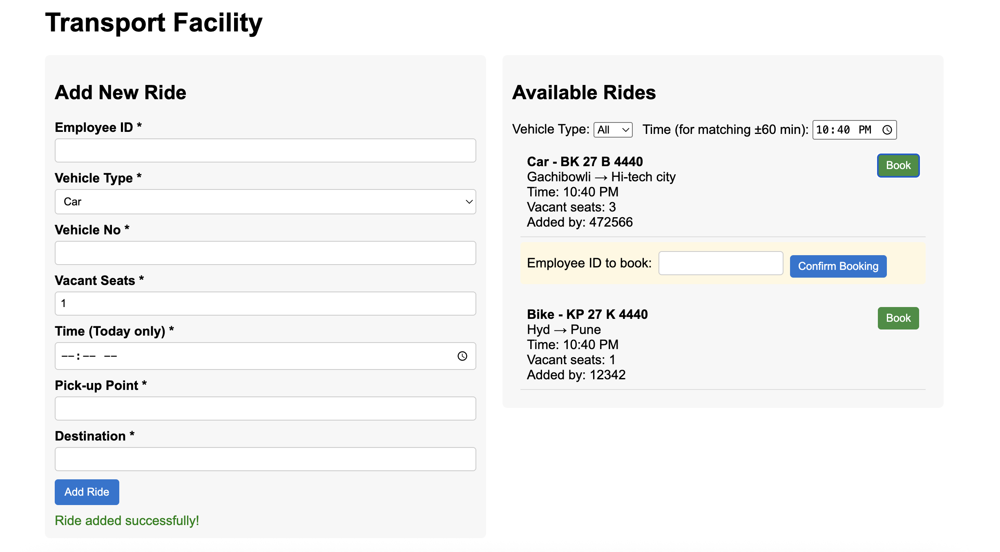

# 🚖 Transport Facility Management (Angular Assignment)
A simple Angular web application to manage employee transport rides.

Employees can **add a ride, search/filter rides, and book rides** for the current day.

This app was built as per the assignment requirements:

* **No CSS frameworks** used (only plain CSS).
* **Angular 15+** with Reactive Forms.
* **Unit Tests** included (Jasmine + Karma).
* Data stored in memory via a service (no backend).

---
## 📌 Features
1. **Add Ride**
   * Employee ID (unique per ride, required)
   * Vehicle Type (Car / Bike)
   * Vehicle Number (required)
   * Vacant Seats (required, >0)
   * Time (current day only, required)
   * Pickup Point (required)
   * Destination (required)

2. **Book Ride**
   * Employee enters their ID to book a ride.
   * Rules: 
      * Cannot book own ride.
      * Cannot book same ride twice.
      * Vacant seats decrement when booking succeeds.

3. **Search & Filter**
   * Filter by vehicle type (Car, Bike, All).
   * Show rides within **±60 minutes** of selected time.

4. **Validation & Error Handling**
   * Mandatory fields enforced.
   * Unique ride creation per Employee ID.
   * Current day validation for rides.

5. **Unit Testing**
   * Covers RideService (add, book logic).
   * Covers AddRideComponent validations.

src/app/
├── components/
│   ├── add-ride/          # Create new rides
│   ├── book-ride/         # Book existing rides
│   └── ride-list/         # Display and filter rides
├── models/
│   └── ride.model.ts      # Ride data model
└── services/
    └── ride.service.ts    # Ride management service

## 📸 Screenshot

